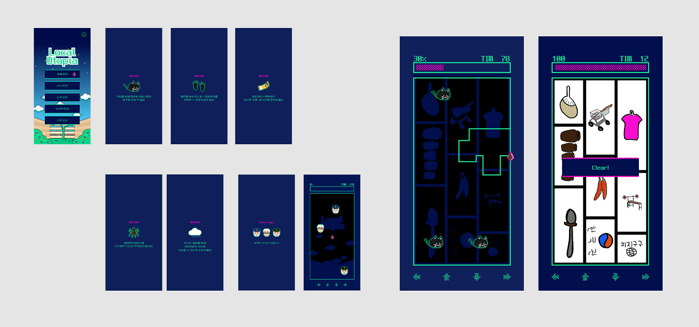
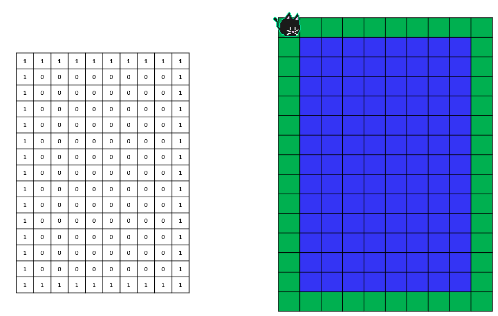
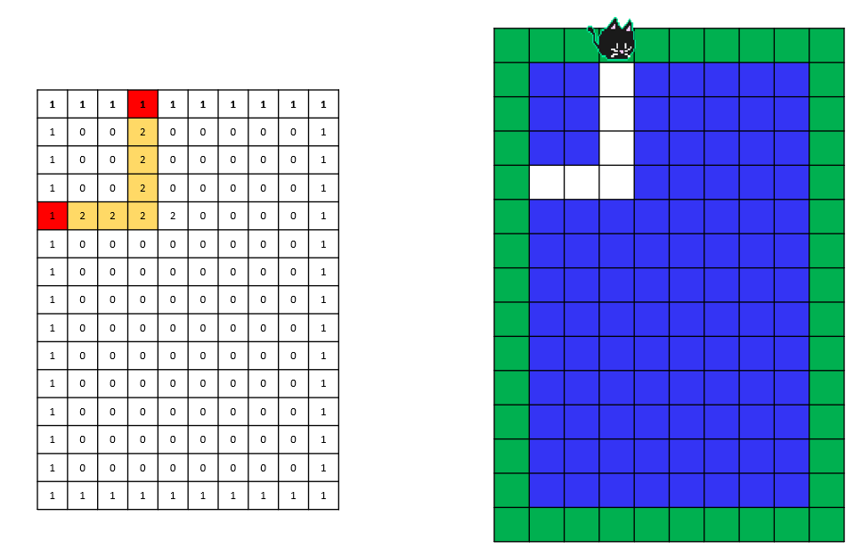
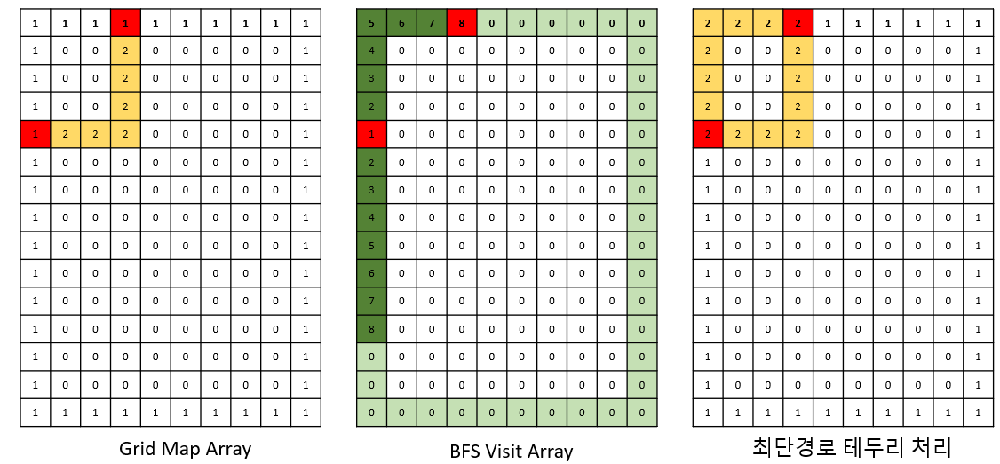
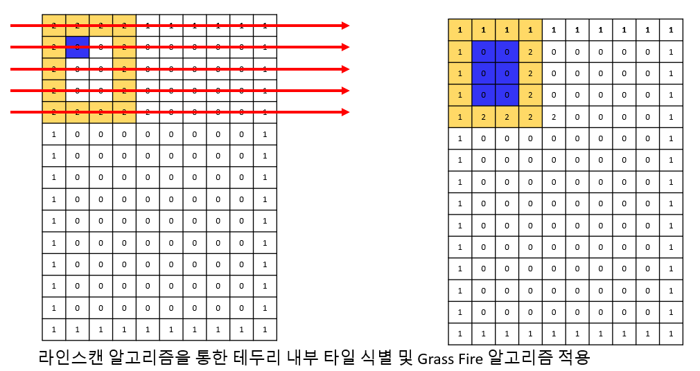

# 🗺️ Project: 로컬 유토피아
## 땅따먹기를 통한 거점공간 예술작품 탐방 게임

---

  

**로컬 유토피아**는 충북문화재단 2022년 창작거점공간지원사업으로 제작된  
**청주시 중앙동 탐방형 모바일 땅따먹기 게임**입니다.  
플레이어는 탐정이 되어 지역 아티스트들이 제작한 작품을 배경으로 게임을 진행하며,  
예술을 탐색하고 거점공간의 의미를 유추해 나갑니다.

---

## 🛠️ 사용 기술

`Unity` `C#`

---

## 🔗 플레이 링크

👉 [게임 페이지 바로가기](https://plinqer.cc/71)

---

## 👥 프로젝트 정보

- **진행 기간**: 2022.10.15 ~ 2022.12.03  
- **참여 인원**: 총 7명 (개발 1, 기획 1, 디자인 1, 스토리 4)
- **담당 역할**:  
  **아트 테크니션**  
  - 땅따먹기 게임 커스텀 로직 개발  
  - UI 및 게임 내 애니메이션, GIF 처리 로직 구현

---

## 🎯 프로젝트 목표

- 지역 예술 공간에 대한 탐색을 게임화하여 **몰입형 체험 제공**
- 아티스트들의 시각예술을 **배경화면으로 통합**
- 점령 영역에 따라 작품 이미지가 드러나는 구조 설계

---

## ⚙️ 기여한 작업: 땅따먹기 커스텀 로직

### 문제 정의

기존 땅따먹기 오픈소스는 다음의 요구사항을 충족하기 어려웠습니다:

- GIF 형식 배경 이미지 반영
- 점령 영역을 부드럽게 드러내는 알파 처리
- 커스텀 장애물, 특수 타일 지원

---

## 🔍 해결 과정 단계별 설명

### 1. 초기 맵 상태

  

- 게임 시작 시 전체 맵은 미탐색 상태로, 배경이 가려진 상태입니다.
- 각 타일은 점령 가능한 단위로 나뉘어 있으며, 플레이어는 움직이며 탐색을 시작합니다.

---

### 2. 플레이어 이동 경로 기록

  

- 플레이어가 이동하며 선을 그립니다.
- 이동한 경로는 테두리를 형성하게 됩니다.

---

### 3. BFS로 점령 테두리 결정

  

- 플레이어의 이동 궤적을 기반으로 BFS를 수행해 **점령 가능한 폐쇄된 영역**의 테두리를 계산합니다.
- 충돌 여부, 탐색 불가능 영역 등을 실시간으로 확인하며 테두리를 확정합니다.

---

### 4. 내부 타일 점령 처리

  

- **스캔라인 알고리즘**으로 점령 테두리 내부의 타일 좌표를 추출합니다.
- **Grass Fire 알고리즘**을 활용해 내부 영역을 재귀적으로 처리합니다.
- 점령된 타일의 **알파(α)값을 0으로 설정**하여, 아래에 있던 예술작품 이미지가 자연스럽게 나타나도록 처리합니다.

---

## 📌 핵심 성과

- 예술작품과 게임을 결합한 지역 탐방형 콘텐츠 기획 및 개발
- Unity 기반 땅따먹기 알고리즘 커스터마이징 성공
- 작품 노출을 위한 실시간 알파 블렌딩 시스템 구현

---

